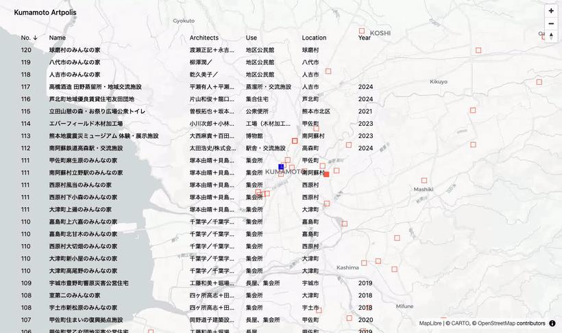

# kumamoto-artpolis

A static site cataloging the buildings and structures of the [Kumamoto
Artpolis](https://www.pref.kumamoto.jp/soshiki/115/85889.html) architecture
program, paired with a log of my visits to them. Built to keep track of what
I've seen and what's left to go.

**Live demo → [artpolis.tkoyasak.dev](https://artpolis.tkoyasak.dev)**

## About

Kumamoto Artpolis (KAP) is Kumamoto Prefecture's architecture initiative,
running since 1988, that commissions and showcases distinctive public buildings
and structures — houses, bridges, stations, parks — across the prefecture. This
site is a personal catalog of those works and a record of visiting them.

## Features

- **A linked table and map.** The home page pairs a sortable table of every
  catalog entry with a fullscreen map. Hovering a row highlights its marker, and
  hovering a marker highlights its row.
- **A page per entry.** Every entry has its own prerendered detail page with its
  particulars and links.
- **A visit timeline.** A separate `/status` page logs site visits, newest
  first; an entry's marker is styled by whether it's been visited.

## Engineering highlights

Small site, deliberately over-built. A few pieces I'm happy with:

- **The map persists across navigation.** A single MapLibre instance lives under
  `transition:persist` and survives page swaps instead of re-initializing. A
  detail page never moves the camera — it `clip-path`-crops the same map around
  the focused marker.
- **Clicking a row morphs it into the detail page.** Over a View Transition,
  only the clicked row is named, so that one row animates into the detail page's
  subject row and back.
- **Two islands linked by shared state.** The table (Preact) and the map
  (vanilla MapLibre) are independent islands with no direct coupling — the hover
  link rides entirely on one nanostore atom.
- **MapLibre is code-split, not preloaded.** The map library and its markers
  load lazily when the map first shows, keeping them off the initial critical
  path.

## Stack

- Astro (SSG — every page prerendered)
- Preact table island + MapLibre GL map island
- Tailwind CSS
- Cloudflare Workers static assets

## Development

Tooling comes from the Nix flake devShell (via direnv, or `nix develop`), and
the package manager is bun. The commands — dev server, checks, unit tests,
e2e — are in [`docs/agents/commands.md`](docs/agents/commands.md).

## Docs

The `docs/` tree carries the project's working context and its reasoning:

- [`docs/agents/`](docs/agents) — current-state working context: the domain
  glossary, content model, routing, and the table/map islands.
- [`docs/adr/`](docs/adr) — the decision log: _why_ the code is shaped this way.
- [`docs/findings/`](docs/findings) — empirical findings: benchmarks and browser
  behavior worth not rediscovering.

## License

[MIT](LICENSE)
